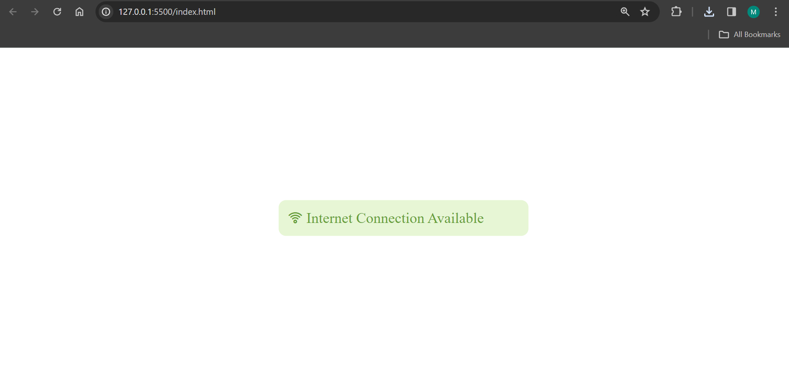
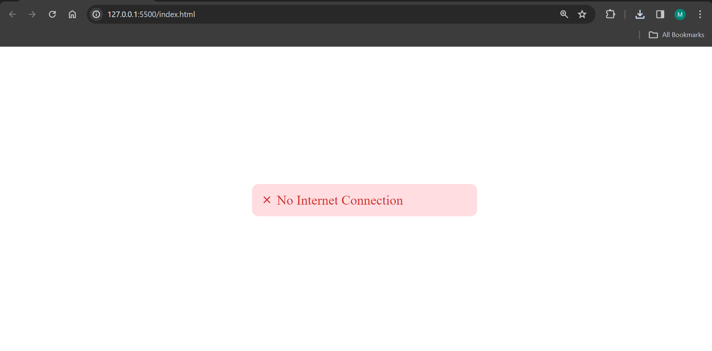

# Check Internet Connection Status

This simple web application checks the internet connection status of the user and displays a popup message accordingly.

## Usage

1. Clone the repository to your local machine.
2. Open `index.html` in your web browser.

## Features

- Displays a popup message indicating whether there is an internet connection or not.
- If online, the popup message displays "Internet Connection Available" with a green background and a Wi-Fi icon.
- If offline, the popup message displays "No Internet Connection" with a red background and a times icon.
- Clicking on the popup message hides it.

## Screenshots

### Internet Connection Available

### No Internet Connection

## Technologies Used

- HTML
- CSS
- JavaScript

## Dependencies

- [Google Fonts](https://fonts.googleapis.com/css2?family=Poppins:wght@600&display=swap) for the Poppins font.
- [UniIcons](https://iconscout.com/unicons) for the icon set.